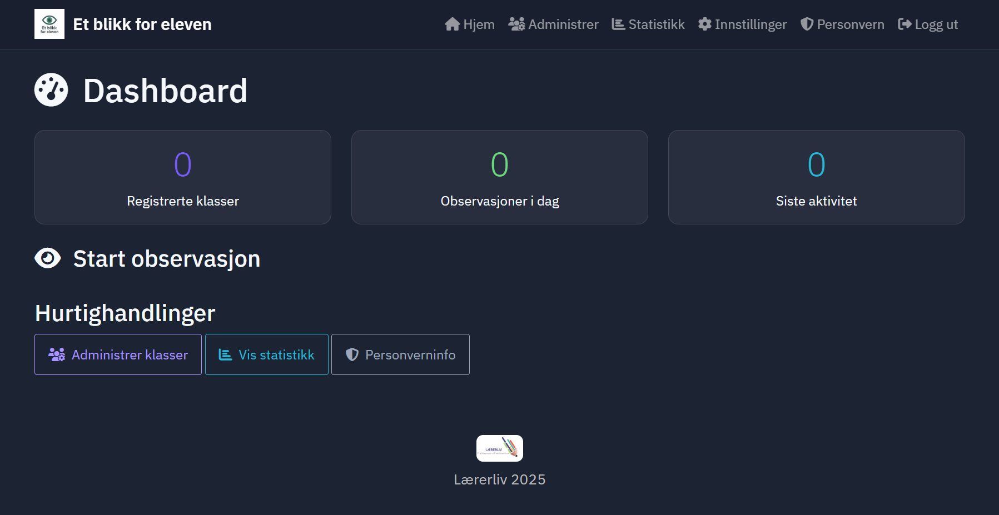

# 🧑‍🏫 TeacherTracker

Et enkelt observasjonsverktøy for lærere som ønsker å registrere elevers engasjement i sanntid.

---

## 🚀 Funksjoner

- Registrer klasser og elever
- Start observasjon med ett klikk
- Se siste aktivitet og statistikk
- All data lagres lokalt (ingen skytjenester)

---

## 🖼️ Skjermbilde

Her er et glimt av dashboardet i TeacherTracker:

---

## 🧪 Prøv det selv

1. Klon repoet
2. Installer avhengigheter
3. Kjør appen med `python3 app.py`
4. Åpne i nettleseren på `http://127.0.0.1:5000`